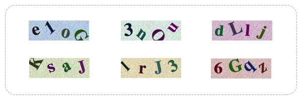

# Generating Verification Code with Canvas API

<div align="center">
  
</div>

## Before you start

1. READ and UNDERSTAND the code, detailed explainations are provided in comments. Also, check the reference links below
2. TWEAK the settings (font style, color, translate pos, rotation, scale) to however you want them to be if needed
3. HAVE FUN playing with the code, they are ALIVE!

<br>

使用代码前，推荐先做以下几件事：

1. **读懂**代码。源码中有详细的注释说明（英文），或者阅读 [我的解读文章（中文）](https://levblanc.com/js/canvas-verification-code.html) 及参考最下方的 [References](#References)
2. 调整源码中对字体、颜色、位移、旋转、缩放的设置，以切合自己的需求
3. 代码是活的，享受每一次尝试的过程

## Usage

1. Copy `canvas-verification-code.js` and `codeBg.png` to your repo.
2. Make sure your project has a es6 compiler (e.g.: Babel) to compile the code

<br>

使用方法：

1. 把`canvas-verification-code.js` and `codeBg.png`复制到项目下
2. 项目中需要有可以把 es6 编译为 es5 的工具，例如 Babel

### Plain Html and Javascript

See it live on [CODEPEN](https://codepen.io/levblanc/pen/bxNPNB/)

```html
<div class='verificationCode'>
  <!-- use css absolute positioning to put codeBg.png   
    underneath your verification code -->
  <div class='codeBackground'></div>
  
</div>

<!-- ... ... -->

<script src='/path/to/canvas-verification-code.js'>
<script>
var verificationCode = generateCode(120, 40)

var codeImage = document.getElementsByClassName('codeImage')[0]

codeImage.src = verificationCode.data
</script>
```

### Using Vue.js 2.0

See it live on [CODEPEN](https://codepen.io/levblanc/pen/yxywEx/)

```pug
<template lang='pug'>
  div(id='app' class='verificationCode')
    //- use css absolute positioning to put codeBg.png   
    //- underneath your verification code
    div(class='codeBackground')
    img(
      class='codeImage'
      :src='imageData'
      alt='verificationCode'
    )
    br
    input(v-model='codeInput' placeholder="enter code")
    p code input is: {{ validInput }}
</template>
```

```javascript
import generateCode from '/path/to/canvas-verification-code.js'

export default {
  data() {
    return {
      codeInput: '',
      imageData: '',
      codeText : '',
    }
  },
  computed: {
    validInput() {
      return this.codeText === this.codeInput
        ? 'correct'
        : 'not correct'
    }
  },
  mounted() {
    const { code, data } = generateCode(120, 40)

    this.imageData = data
    this.codeText  = code
  }
}
```

## Params

| name    | type     | required | meaning                     | default | options |
| :-----: | :------: | :------: | :------------------------:  | :-----: | :-----: |
| width   | number   | true     | width of canvas background  |         |         | 
| height  | number   | true     | height of canvas background |         |         | 
| type    | string   | false    | type of code characters     | "default" <br/> (mix of letter and number) | "letter", "number" | 
| codeLen | number   | false    | length of code characters   | 4       | positive integers | 


## References

[1] [Math.random() @ MDN](https://developer.mozilla.org/en-US/docs/Web/JavaScript/Reference/Global_Objects/Math/random)

[2] [Generating random whole numbers in JavaScript in a specific range?](https://stackoverflow.com/questions/1527803/generating-random-whole-numbers-in-javascript-in-a-specific-range)

[3] [Canvas tutorial @ MDN](https://developer.mozilla.org/en-US/docs/Web/API/Canvas_API/Tutorial)

[4] [html5 Canvas画图教程26:用transform来实现位移,缩放,旋转等](http://jo2.org/html5-canvas-transform/)

[5] [shoestrong/validate-code-canvas](https://github.com/shoestrong/validate-code-canvas)

[6] [KIDx/verify-code](https://github.com/KIDx/verify-code)

[7] [jovey-zheng/verify-code](https://github.com/jovey-zheng/verify-code)

[8] [F-happy/verification-code](https://github.com/F-happy/verification-code)